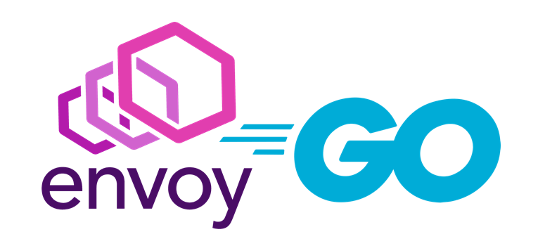

# EGo-Demo



This is a demo of how to build a Golang filter for Envoy, based on the [Envoy
Filter Example project](https://github.com/envoyproxy/envoy-filter-example),
by using Go's [CGo](https://golang.org/cmd/cgo/) feature.

It is still a little rough on the edges, though probably good enough to help
understand most of the challenges and benefits of this approach.

## Design Principles

* Provide a **Go-native experience** for Go developers
* Support **zero-copy** data access where possible
* **Unopinionated** interface: reflect the envoy C++ interface classes as close as possible

## Successes

* Parsing and passing filter configuration from C to Go with zero-copy and leveraging Envoy's protobuf validation mechanism
* Communication between C and Go with zero-copy and strongly parallel interface design
* Allow the use of goroutines with minimal discipline required (`Pin`/`Post`/`Unpin`)
* Creating new filters without having to touch C code (except when "lifting up" new envoy interfaces)
* Support interactions with SDS via Envoy's built-in client

## Challenges

This project is still in its infancy, and there are a couple of technical
challenges still waiting to be solved.

### Dependency Cycles

In order to call Go functions from C, the go libraries need to be built first
(as this produces the required C headers). However, the Go libraries also have a
dependency on C libraries (to facilitate calls to envoy functions).

This can, in most cases, be mitigated by careful separation of the functions
needed for the Go->C interactions from the functions implementing the envoy L7
filter interfaces.

When there are functions that are needed on both sides, this often requires
creativity. A good example for this is the `onPost` handler, which needs to be
passed as a callback on the Go->C side, but has an implementation that needs to
make a C->Go call.

Since this obviously isn't a limitation of linkers or C, the situation could
probably mitigated by extending the Bazel tooling (for example, by separating
the generation of Go C headers and the Go library).

### CGo limitations

Currently, there can only be one CGo library, and its `main()` function needs to
reside in the same package containing the CGo code. This means that `egofilters`
needs to be referenced from the `ego` package and can't contain CGo code. This
is probably the most significant issue because it is in direct opposition to
the desired architecture.

### Replication of Envoy classes as Go interfaces

This is a work intensive process, and the only reason we chose to take on this
challenge is that it typically is a one-off effort that will become less notable
over time.

Keeping up with Envoy's changing C++ interface also requires regular effort, and
in fact, this project currently doesn't account for different Envoy versions,
although it probably should.

## Prerequisites

### Bazel

#### MacOS

To set up bazel on MacOS, [install Homebrew](https://docs.brew.sh/Installation)
and then

```bash
brew install bazelbuild/tap/bazelisk
brew install coreutils wget cmake libtool go bazel automake ninja clang-format autoconf aspell
```

(Don't worry if you get a warning for a symlink that couldn't be updated because
bazelisk is sitting on it -- this is by design)

## Building

```bash
git submodule update --init  # clone the linked envoy tag into /envoy
bazel build //:envoy         # build envoy with the new libraries added
```

Note: This version requires Envoy v1.14

## Trying It Out

This demo includes two example filters:

* [getheader](egofilters/http/getheader) is a very basic filter that showcases
  using go-routines and the Go runtime library for HTTP requests. Its sole
  purpose is to retrieve response header `hdr` from a GET request for URL `src`,
  and inject it as request header `key` into the request to the upstream
  service.

* [security](egofilters/http/security) is a more elaborate piece outlining a
  framework to accomodate many different custom authentication methods, to show
  how things might pan out at scale. This is showcased via a simple pseudo-HMAC
  filter with the actual checksum calculations delegated to a separate [REST
  service](services/hmac/main.go) to once more demonstrate how to align
  Go-routines and envoy worker threads as well as to motivate the use of SDS
  based secrets.

To play with it, go to the repository root, and do

```bash
bazel run ego-demo
```

This spins up a simple [echo service](services/echo/main.go) as upstream for all
requests, an [HMAC authentication provider sidecar](services/hmac/main.go), and
the Envoy proxy [configured](envoy.yaml) to showcase the Go-based filters
provided with this demo.

```bash
curl -iX GET 'http://127.0.0.1:8080/Hello,world!'
```

Note the `X-Getheader-Result` in the response which was injected into the
request by the `getheader` filter

```bash
curl -iX GET 'http://127.0.0.1:8080/hmac/unsigned' -H 'Authorization: client_id:123'
```

This should produce a `401 Unauthorized` response

```bash
curl -iX GET 'http://127.0.0.1:8080/hmac/unsigned' -H 'Authorization: client_id:17'
```

The expectation would be a `200 OK` response.

```bash
curl -iX GET 'http://127.0.0.1:8080/hmac/signed' -H 'Authorization: client_id:15'
```

This should also result in a `200 OK` response, and a
`x-custom-auth-signature-hmac-sha256: 200_nnn` response header (which clearly
isn't the SHA256 HMAC but just the status code with the length of the response
body appended).

## Tinkering

The Go code is integrated with bazel via `rules_go`. The bazel rules
areautomatically generated by `gazelle`, and interfaces mocks are generated via
`mockery`.

### Running Tests

The EGo interface layer still deserves a bit more rigorous testing, only some
mind-numbing permutation testing for the most critical pieces has already been
implemented so far, please budget a couple of minutes for this to run.

```bash
bazel test //ego/...
```

Since the HMAC filter is a gutted version of a more elaborate thing, coverage
is relatively good (although not very pretty to read).

```bash
bazel test //egofilters/...
```

#### Note for MacOS users

Please see [Envoy issue #10478](https://github.com/envoyproxy/envoy/issues/10478)
if some of the C++ tests fail with this message:

```plain
dyld: Symbol not found: _program_invocation_name
```

This is most likely means XCode needs to be installed.

### Updating the Go Rules

From the repository root, do

```bash
bazel run gazelle
```

### Adding new Go Dependencies

From the repository root, do

```bash
bazel run //:gazelle -- update-repos -from_file=go.mod
```

### Bazel and Go Interface Mocks

Make sure you have installed [mockery](https://github.com/vektra/mockery/releases).
Then, from the repository root, do

```bash
tools/copy_pb_go.py  # update generated protobuf bindings

cd egofilters/mock
go generate

cd ../../ego/test/go/mock
go generate

cd ../../../..
bazel run gazelle    # just in case
```

Bazel integration of this is work in progress...
